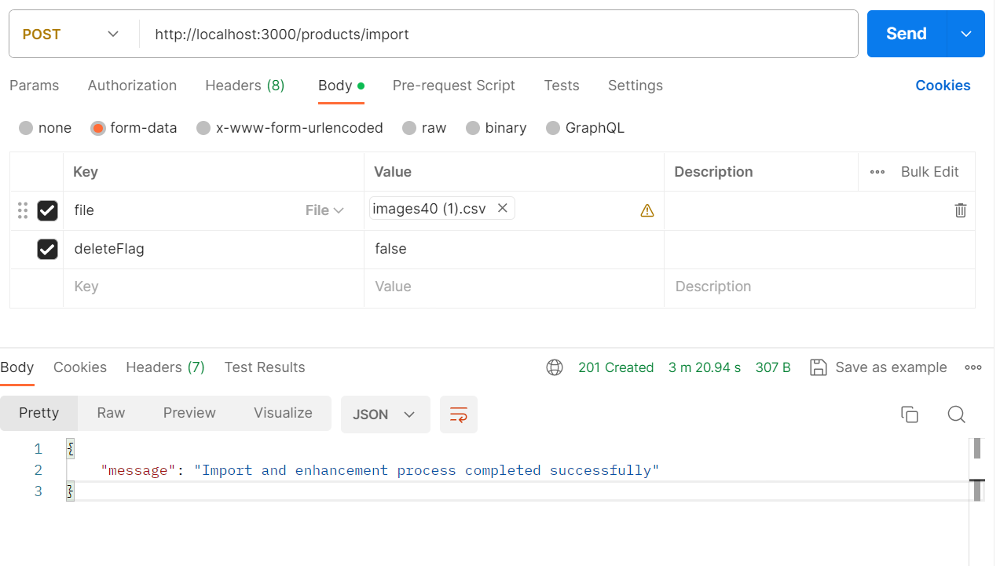

# product-import

Before running this application, make sure you have the following software installed on your computer:

- Node.js: You can download it from [nodejs.org](https://nodejs.org/)
- Nest CLI - You can install it globally using npm: `npm i -g @nestjs/cli`

## Getting Started

Follow these steps to run the app locally:

1. **Clone the repository**:
`git clone https://github.com/DmytroTarasiuk/product-import.git`

2. **Navigate to the project directory**:
`cd product-import`

3. **Install Dependencies**:
`npm install`

4. **Start the Development Server**:
`npm start`

## How to use

To run this application, ensure you have the necessary credentials for both **MongoDB** and **OpenAI**.

### MongoDB Connection String

1. Generate a MongoDB connection string in the following format:

   ```plaintext
   mongodb+srv://<username>:<password>@cluster0.pkzgrkv.mongodb.net/<database-name>

Replace `<username>`, `<password>`, and `<database-name>` with your MongoDB credentials.

### OpenAI API Key

1. Obtain your **OpenAI** API key from [OpenAI Platform](https://platform.openai.com/api-keys).

### Environment Configuration

1. Create a file named `.env` in the root directory of the project.

2. Set the following environment variables in the `.env` file:

```env
MONGODB_CONNECTION_STRING=<your-mongodb-connection-string>
OPEN_AI_API_KEY=<your-openai-api-key>;
```

### Importing CSV Data

1. Start the server by running the command:

   ```bash
   npm start

Wait until you see the log message: `Nest application successfully started +10ms.`

2. With the server running, make a POST request to `http://localhost:3000/products/import` to initiate the data import.

Include a CSV file in the request body for data import.
Optionally, include a deleteFlag (boolean) in the request body to control deletion behavior.
Example using cURL:

curl -X POST \
  http://localhost:3000/products/import \
  -H 'Content-Type: multipart/form-data' \
  -F 'file=@path/to/your/file.csv' \
  -F 'deleteFlag=false'

You can use a csv file from `./files/images40(1).csv` for testing purposes.

After initiating the data import, it's crucial to monitor the server logs for progress and any potential errors. Follow these steps:

3. Keep an eye on the terminal where the server is running. Look for log messages related to the data import process:

   ```bash
   Nest application successfully started +10ms
   [Nest] ... Importing data from CSV file ...
   [Nest] ... Data import completed successfully ...

An example of sending POST import request:


